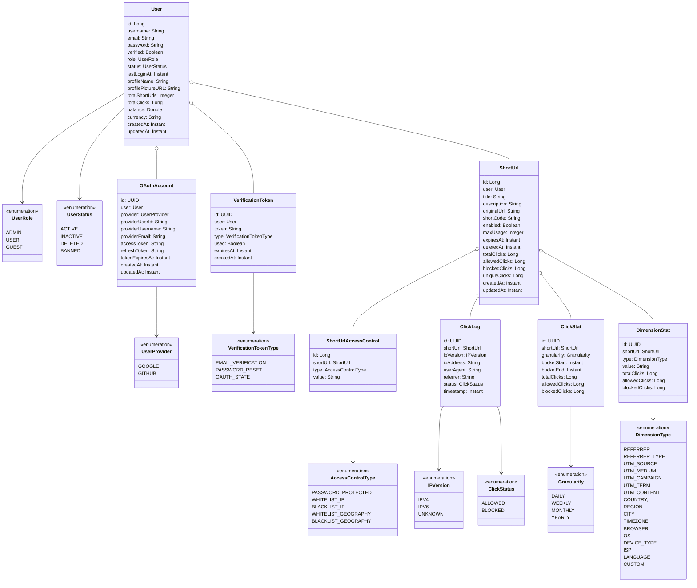

```mermaid
classDiagram
    class UserRole {
        <<enumeration>>
        ADMIN
        USER
        GUEST
    }

    class UserStatus {
        <<enumeration>>
        ACTIVE
        INACTIVE
        DELETED
        BANNED
    }

    class UserProvider {
        <<enumeration>>
        GOOGLE
        GITHUB
    }

    class AccessControlType {
        <<enumeration>>
        PASSWORD_PROTECTED
        WHITELIST_IP
        BLACKLIST_IP
        WHITELIST_GEOGRAPHY
        BLACKLIST_GEOGRAPHY
    }

    class IPVersion {
        <<enumeration>>
        IPV4
        IPV6
        UNKNOWN
    }

    class ClickStatus {
        <<enumeration>>
        ALLOWED
        BLOCKED
    }

    class Granularity {
        <<enumeration>>
        DAILY
        WEEKLY
        MONTHLY
        YEARLY
    }

    class DimensionType {
        <<enumeration>>
        REFERRER
        REFERRER_TYPE
        UTM_SOURCE
        UTM_MEDIUM
        UTM_CAMPAIGN
        UTM_TERM
        UTM_CONTENT

        COUNTRY,
        REGION
        CITY
        TIMEZONE

        BROWSER
        OS
        DEVICE_TYPE
        ISP
        LANGUAGE

        CUSTOM
    }

    class VerificationTokenType {
        <<enumeration>>
        EMAIL_VERIFICATION
        PASSWORD_RESET
        OAUTH_STATE
    }

    class User {
        id: Long

        username: String
        email: String
        password: String

        verified: Boolean
        role: UserRole
        status: UserStatus
        lastLoginAt: Instant

        profileName: String
        profilePictureURL: String

        totalShortUrls: Integer
        totalClicks: Long

        balance: Double
        currency: String

        createdAt: Instant
        updatedAt: Instant
    }

    class OAuthAccount {
        id: UUID
        user: User

        provider: UserProvider
        providerUserId: String
        providerUsername: String
        providerEmail: String

        accessToken: String
        refreshToken: String
        tokenExpiresAt: Instant

        createdAt: Instant
        updatedAt: Instant
    }

    class VerificationToken {
        id: UUID
        user: User

        token: String
        type: VerificationTokenType
        used: Boolean

        expiresAt: Instant
        createdAt: Instant
    }

    class ShortUrl {
        id: Long
        user: User

        title: String
        description: String

        originalUrl: String
        shortCode: String

        enabled: Boolean
        maxUsage: Integer

        expiresAt: Instant
        deletedAt: Instant

        totalClicks: Long
        allowedClicks: Long
        blockedClicks: Long
        uniqueClicks: Long

        createdAt: Instant
        updatedAt: Instant
    }

    class ShortUrlAccessControl {
        id: Long
        shortUrl: ShortUrl

        type: AccessControlType
        value: String
    }

    class ClickLog {
        id: UUID
        shortUrl: ShortUrl
        ipVersion: IPVersion
        ipAddress: String
        userAgent: String
        referrer: String
        status: ClickStatus
        timestamp: Instant
    }

    class ClickStat {
        id: UUID
        shortUrl: ShortUrl
        granularity: Granularity
        bucketStart: Instant
        bucketEnd: Instant
        totalClicks: Long
        allowedClicks: Long
        blockedClicks: Long
    }

    class DimensionStat {
        id: UUID
        shortUrl: ShortUrl
        type: DimensionType
        value: String
        totalClicks: Long
        allowedClicks: Long
        blockedClicks: Long
    }

    User o-- OAuthAccount
    User o-- VerificationToken
    User o-- ShortUrl
    ShortUrl o-- ShortUrlAccessControl
    ShortUrl o-- ClickLog
    ShortUrl o-- ClickStat
    ShortUrl o-- DimensionStat

    User --> UserRole
    User --> UserStatus
    OAuthAccount --> UserProvider
    VerificationToken --> VerificationTokenType
    ShortUrlAccessControl --> AccessControlType
    ClickLog --> IPVersion
    ClickLog --> ClickStatus
    ClickStat --> Granularity
    DimensionStat --> DimensionType
```
